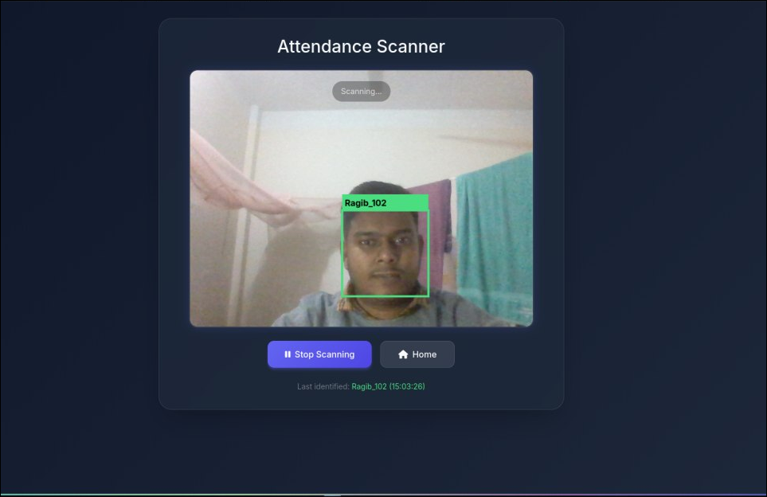

# Face Recognition Attendance System

<p align="center">
  
</p>

<p align="center">
  <a href="https://github.com/ragibcs/face-recognition-attendance-system-v2">
    
  </a>
  <a href="https://github.com/ragibcs/face-recognition-attendance-system-v2">
    
  </a>
  <a href="https://github.com/ragibcs/face-recognition-attendance-system-v2">
    
  </a>
</p>

---

## Features

| Feature | Description |
|---------|-------------|
| 🤖 **Auto Face Detection** | Real-time face detection using Haar Cascades |
| 👤 **Face Recognition** | KNN-based ML model for accurate user identification |
| 📊 **Attendance Logging** | Automatic CSV logging with name, roll & timestamp |
| 🌐 **Web Interface** | Clean Flask-powered UI for user management |
| 🔄 **Auto Model Training** | Model rebuilds automatically when users are added |

## Tech Stack

<p align="left">
  
  
  
  
  
  
</p>

## 🚀 Quick Start

### Installation

```bash
# Clone the repository
git clone https://github.com/ragibcs/face-recognition-attendance-system-v2.git

# Navigate to directory
cd face-recognition-attendance-system-v2

# Install dependencies
pip install -r requirements.txt
```

### Run the Application

```bash
python app.py
```

Then open your browser at: **`http://localhost:5000`**

---

## 📁 Project Structure

```
face-recognition-attendance-system-v2/
├── app.py                              # Main Flask application
├── rebuild_model.py                    # Model training script
├── requirements.txt                    # Python dependencies
├── LICENSE                             # MIT License
├── README.md                           # This file
├── haarcascade_frontalface_default.xml # Face detector
│
├── static/
│   ├── faces/                          # User face images
│   └── face_recognition_model.pkl      # Trained ML model
│
├── templates/                          # HTML templates
│   ├── home.html
│   ├── add_user.html
│   └── attendance.html
│
├── Attendance/                         # Daily CSV logs
│
└── Images/                            # Project assets
    └── attendence.png
```

---

## 📝 License

This project is licensed under the **MIT License** - see the [LICENSE](LICENSE) file for details.

---

<p align="center">
  Made with ❤️ by <a href="https://github.com/ragibcs">ragibcs</a>
</p>
